# Simple Change Data Capture for Everyone

In the past, keeping data in sync between databases and other systems was hard. Companies often built custom scripts or used slow batch jobs. This made data out of date and hard to manage. Debezium was created to solve this problem. It is an open-source project started by Red Hat, designed to make Change Data Capture (CDC) easy, fast, and reliable for everyone. Now, with Debezium, you can stream every change in your database to other systems in real-time.

Debezium has grown to support many databases and is used by companies around the world to build modern, event-driven systems. With Debezium, you can keep your data fresh and consistent everywhere, and react to changes as they happen.

- [Simple Change Data Capture for Everyone](#simple-change-data-capture-for-everyone)
  - [Architecture Diagram](#architecture-diagram)
  - [1. Main Components of Debezium](#1-main-components-of-debezium)
  - [2. Goals and Benefits](#2-goals-and-benefits)
    - [Goals](#goals)
    - [Benefits](#benefits)
  - [3. Short History](#3-short-history)
  - [4. When Should You Use Debezium?](#4-when-should-you-use-debezium)
  - [Dependency Preparation](#dependency-preparation)
  - [Mapping Flow Data From Postges to Kafka via Debezerium](#mapping-flow-data-from-postges-to-kafka-via-debezerium)
  - [Step-by-Step Deployment \& Config](#step-by-step-deployment--config)
    - [1. Starting Docker Services](#1-starting-docker-services)
    - [2. Checking All Service Running](#2-checking-all-service-running)
    - [3. PostgreSQL Setup](#3-postgresql-setup)
    - [4. Debezium Connector Configuration](#4-debezium-connector-configuration)


## Architecture Diagram

The diagram below shows how Debezium works in a typical setup. It illustrates the flow of data changes from the source database, through Debezium connectors and Kafka, to other systems that consume the change events. This design helps keep all systems up-to-date and enables real-time data streaming for modern applications.

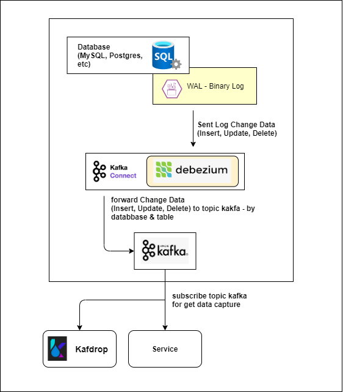

## 1. Main Components of Debezium

Debezium works as a set of connectors running in the **Kafka Connect** environment.

* **Debezium Connectors:** These are the heart of Debezium. Each supported database (like PostgreSQL, MySQL, SQL Server, etch) has its own connector. The connector watches the database’s transaction log (for example, WAL in PostgreSQL or BinLog in MySQL) to capture every **INSERT**, **UPDATE**, and **DELETE** as a data event.
  
* **Apache Kafka Connect:** This is a framework in the [Apache Kafka](https://kafka.apache.org/) ecosystem. It connects and moves data between Kafka and other external systems, like databases, file systems, and storage, and runs the Debezium connectors.
  
* **Apache Kafka:** This is the message broker that acts as a reliable data stream channel. Debezium writes every change event to the right Kafka topic.

* **Kafdrop:** Kafdrop is a web-based UI for viewing and monitoring Kafka topics and messages. It helps you easily browse, inspect, and debug the data streams produced by Debezium, making it simple to verify that change events are flowing correctly through your system.

## 2. Goals and Benefits

The main goal of Debezium is to **stream data changes in real-time** from your database to other systems.

### Goals

* Enable **event-driven architecture**.
* Ensure data consistency across different systems.

### Benefits

* **Near Real-Time Data Streaming:** Data changes are captured and streamed as soon as they happen.
* **Non-Invasive:** Debezium reads the database transaction log, so it does not slow down your main database (unlike using triggers).
* **Reliability:** Because it uses Kafka, event delivery is ordered and reliable.
* **Decoupling:** It separates your main database from downstream applications that need to react to changes.


## 3. Short History

Debezium was first developed by a team at **Red Hat** and released as an open-source project in **2016**. It started with connectors for MySQL and PostgreSQL. The project is built on top of **Kafka Connect**, using the popularity and reliability of the Kafka ecosystem for handling data streams. Since then, Debezium has grown and become a standard for CDC implementations based on Kafka.

## 4. When Should You Use Debezium?

Debezium is best used when you need your database change data instantly and reliably in another place.

| Use Case | Description |
|-|-|
| **Updating Cache** | When a row in the database is updated, Debezium triggers an update in Redis/Memcached cache to keep it in sync. |
| **Maintaining Search Indexes** | When data changes, Debezium sends an event to Elasticsearch or Solr to update the search index right away. |
| **Replicating Data to Data Warehouse** | To replicate data in real-time from an operational database (OLTP) to a data warehouse (OLAP) for analysis. |
| **Microservices Architecture** | Allows one microservice to react to data changes that happen in another microservice (Event Sourcing). |
| **Audit and Change Logs** | To log all data changes (who, when, what) into a central log system. |

In short, use Debezium when you want to build systems that **react to data**, not just process it.

## Dependency Preparation

Before running Debezium, you need to prepare several main components. For this example, we use Docker images from Docker Hub to make setup easy and quick. You can also use Kubernetes, or install each software (Kafka, Zookeeper, PostgreSQL, Debezium) separately on different servers or virtual machines, depending on your needs and infrastructure.

- **Docker & Docker Compose:** These tools help you run all services easily in containers. You can see below how we pull the images from Docker Hub.
  
- **Kafka & Zookeeper:** Kafka is the message broker, and Zookeeper helps manage Kafka. Both are started using Docker Compose.
- 
  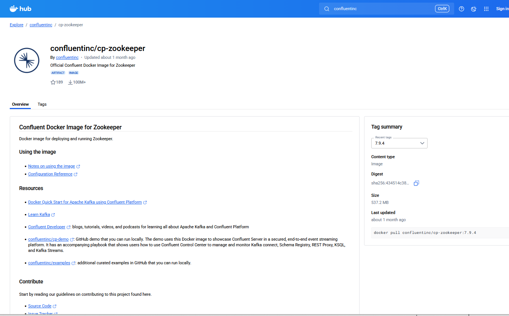

  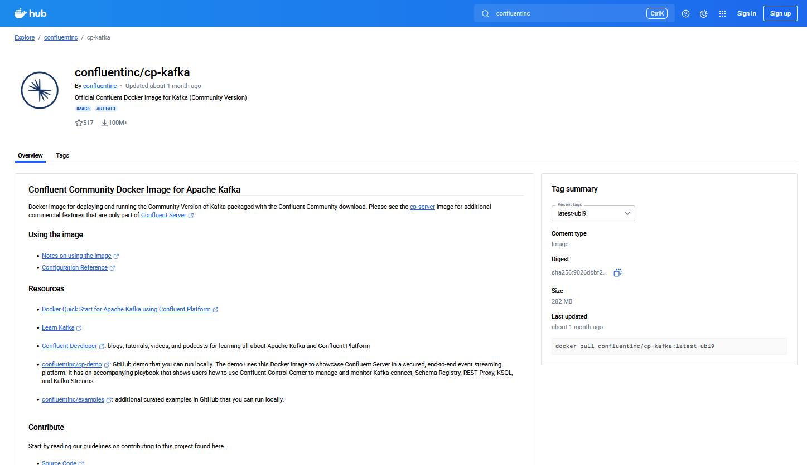

- **Debezium Connect:** This is the service that runs the Debezium connectors. The image is also pulled from Docker Hub.
  
  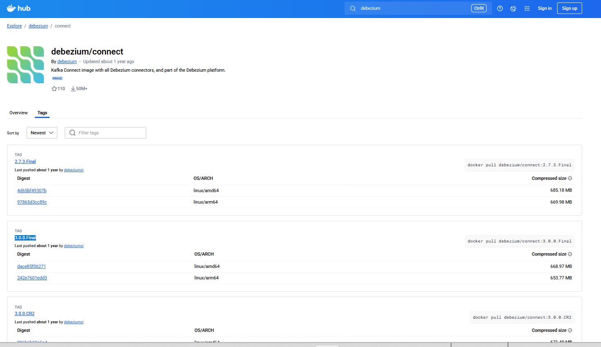

- **Kafdrop:** Kafdrop is a web UI for monitoring Kafka topics and messages. The image is pulled from Docker Hub.
  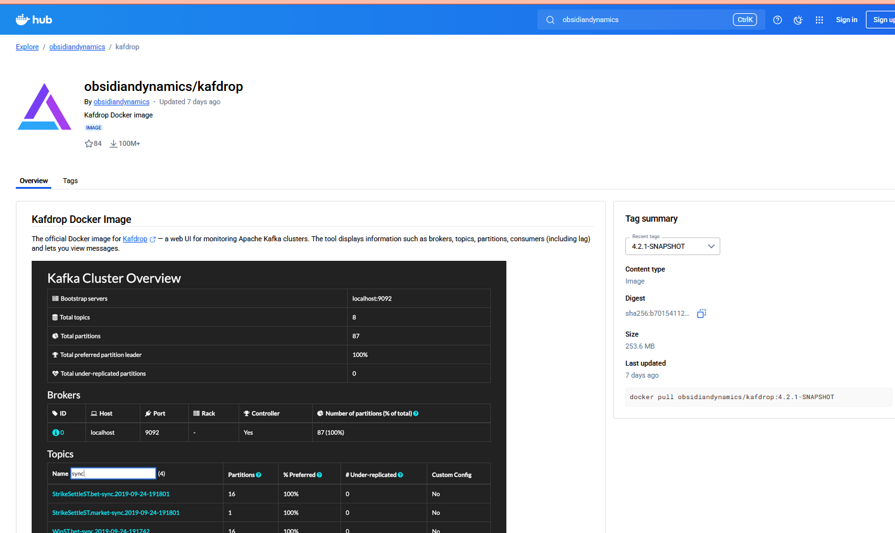

- **PostgreSQL:** The database source for CDC. Make sure logical replication is enabled (`wal_level=logical`). The image is pulled from Docker Hub.
  
  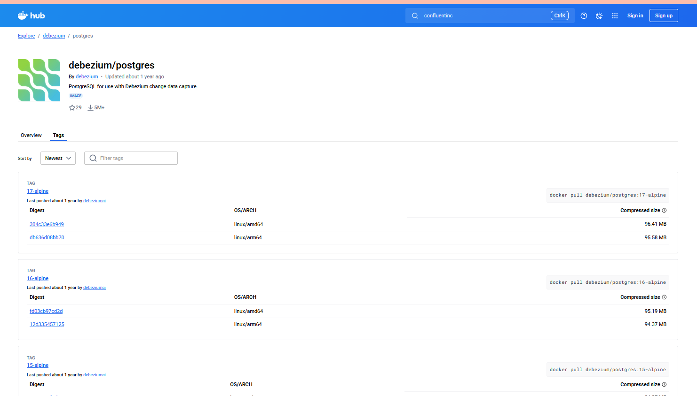

- **Replication User:** You need a user in PostgreSQL with REPLICATION privilege (see `init-replication-user.sql`).

Each image above is downloaded from Docker Hub and used to run the respective service in your environment. This makes the setup process fast, repeatable, and easy to maintain.

## Mapping Flow Data From Postges to Kafka via Debezerium 

The diagram below shows how data changes in PostgreSQL are captured by Debezium, sent to Kafka, and then made available for other systems to consume. This mapping helps visualize the journey of each change event, from the source database, through the CDC pipeline, and into Kafka topics, making real-time integration and analytics possible.

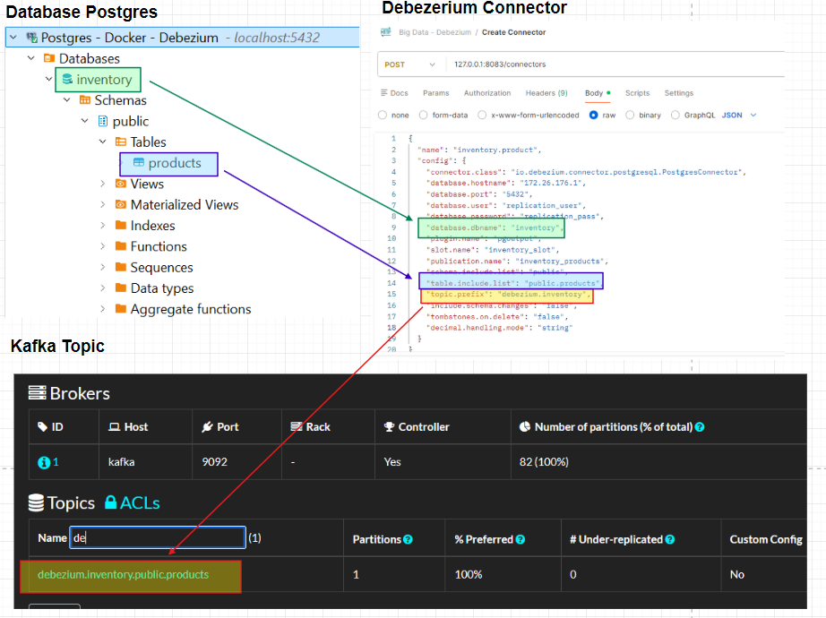


## Step-by-Step Deployment & Config 

### 1. Starting Docker Services

You can run Debezium and all dependencies using Docker Compose. See the provided `docker-compose.yml` file for a ready-to-use setup. This will start:
- Zookeeper
- Kafka (with auto-create topics enabled)
- PostgreSQL (with sample data and replication user)
- Debezium Connect
- Kafdrop (for monitoring Kafka topics)

To start everything, run:
```sh
docker-compose up
```
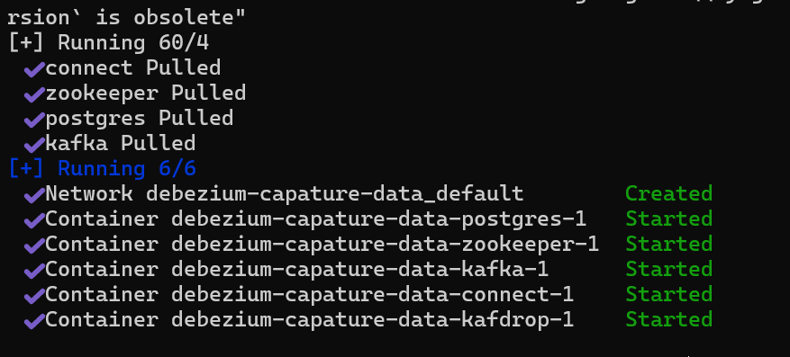

### 2. Checking All Service Running 
- Shows All service running and ready to accept connections.
  
  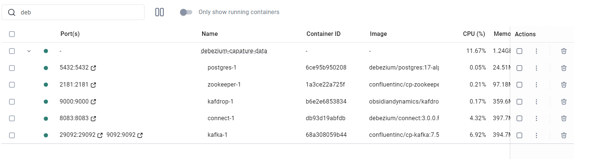

### 3. PostgreSQL Setup
- PostgreSQL service running, ready for connections & Initial database setup, including the creation of the `inventory` database.
  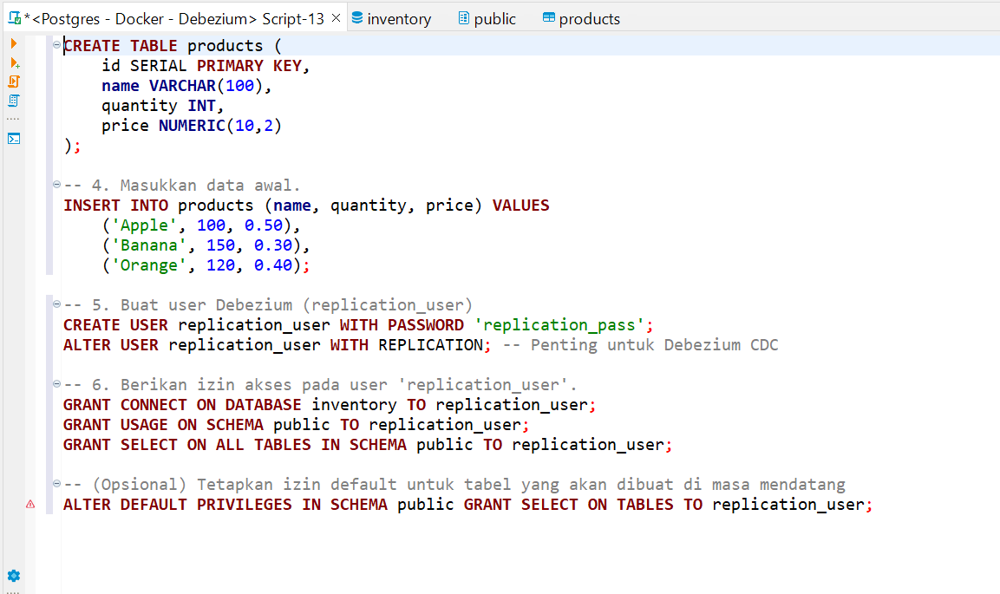

- Creation of the `products` table and insertion of sample data.
  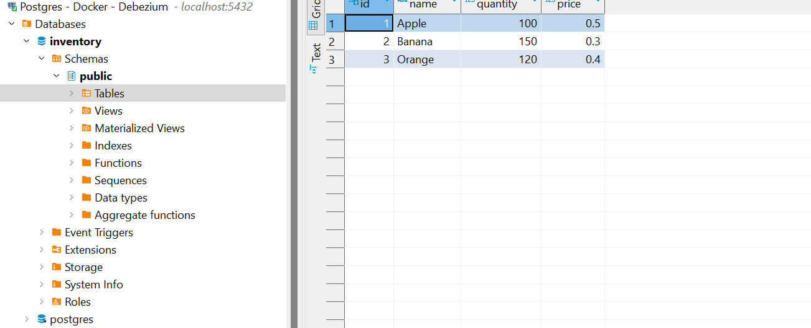

- Creation of the replication user with the required privileges.
  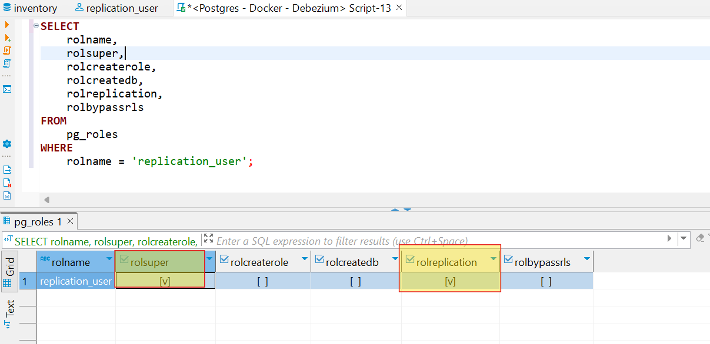

- Logical replication settings (`wal_level=logical`, etc.) applied to PostgreSQL.
  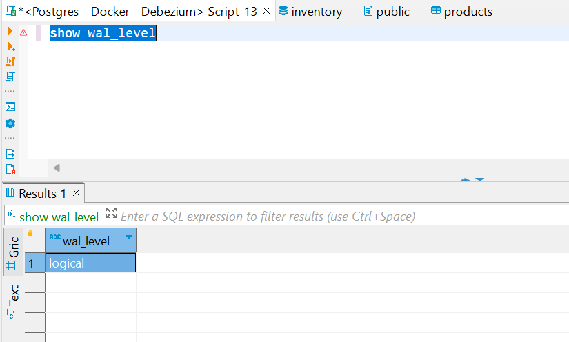

- Create table product set permision for get data befor after change data
  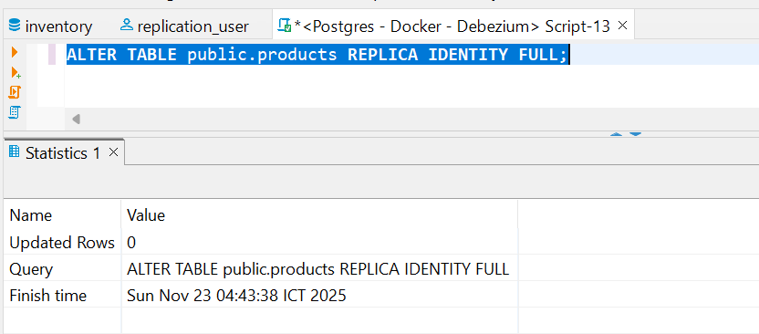

### 4. Debezium Connector Configuration
- **The Debezium Connect REST API, where you configure the connector to monitor PostgreSQL.
  
  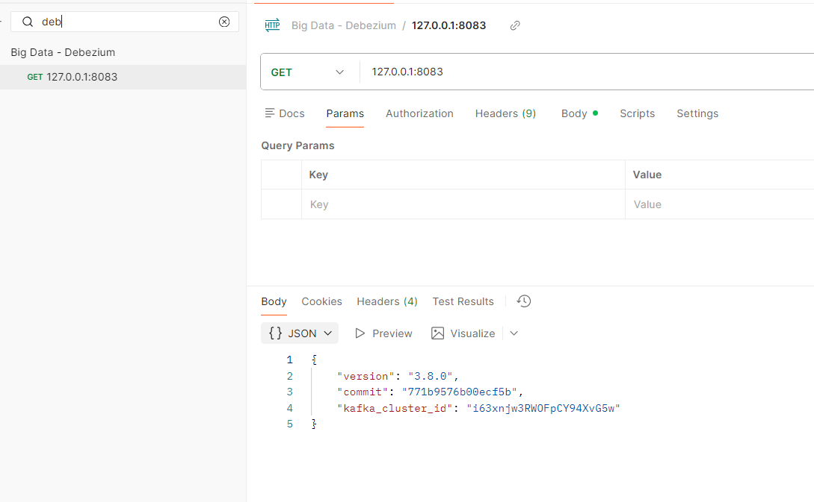

- The connector Create Connector from debezium to database 

  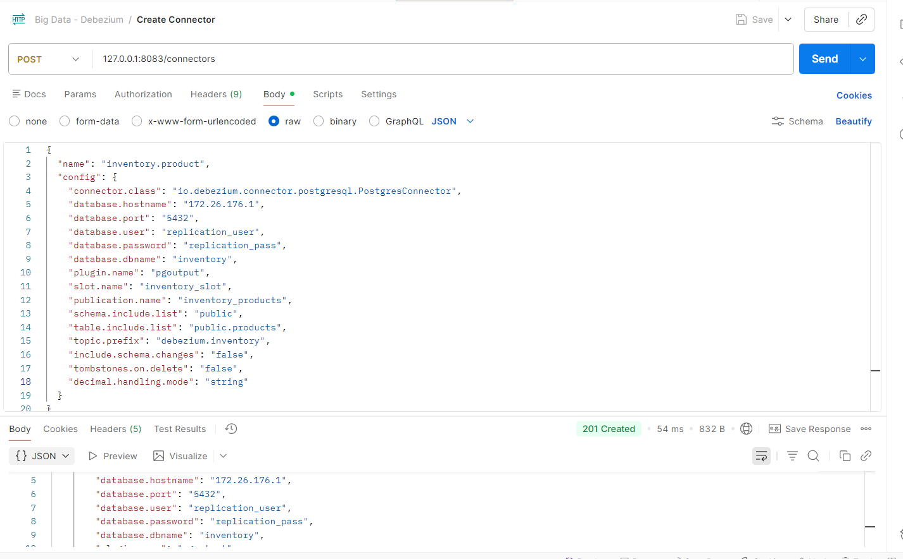

- Shows the connector being created and activated.

  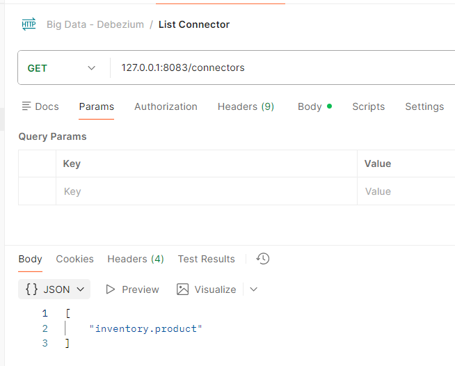

- Shows the connector running and capturing changes from PostgreSQL.

  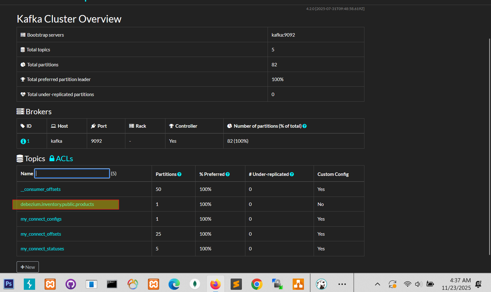

-  Shows change events being sent change data on postgres database send to Kafka topics.

  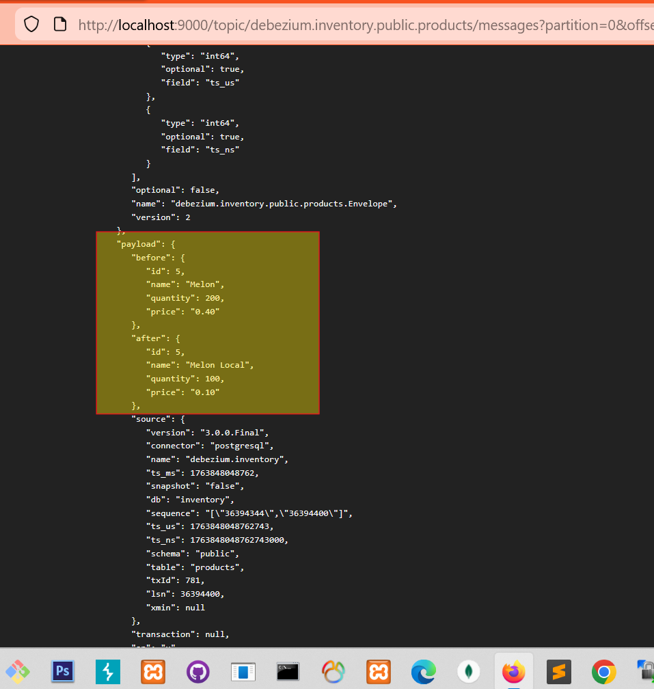
